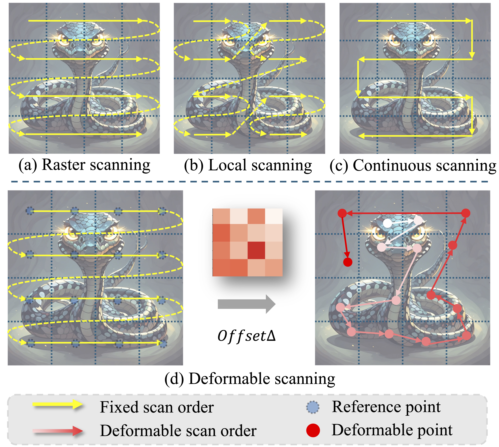

<div align="center">
<h1>DefMamba </h1>
<h3>DefMamba: Deformable Visual State Space Model</h3>
Paper: <a href="https://arxiv.org/pdf/2504.05794">ArXiv:2504.05794</a>
</div>


## Abstract

Recently, state space models (SSM), particularly Mamba, have attracted significant attention from scholars due to their ability to effectively balance computational efficiency and performance. However, most existing visual Mamba methods flatten images into 1D sequences using predefined scan orders, which results the model being less capable of utilizing the spatial structural information of the image during the feature extraction process. To address this issue, we proposed a novel visual foundation model called DefMamba. This model includes a multi-scale backbone structure and deformable mamba (DM) blocks, which dynamically adjust the scanning path to prioritize important information, thus enhancing the capture and processing of relevant input features. By combining a deformable scanning (DS) strategy, this model significantly improves its ability to learn image structures and detects changes in object details. Numerous experiments have shown that DefMamba achieves state-of-the-art performance in various visual tasks, including image classification, object detection, instance segmentation, and semantic segmentation.

## Overview

- Deformable Scanning
<p align="center">
  
</p>

- Deformable State Space Model Architecture
<p align="center">
  
</p>


## Main Results

### **Classification on ImageNet-1K**

|      name      | pretrain | resolution | acc@1 | #params | FLOPs |                                              ckpts                                                | 
|:--------------:| :---: | :---: |:-----:|:-------:|:-----:|:-------------------------------------------------------------------------------------------------------:| 
| DefMamba-Tiny  | ImageNet-1K | 224x224 | 78.6  |   8M    | 1.3G  |   [ckpt](https://drive.google.com/file/d/1UkmsQpM93riFZGed-kgLKhNNl4gjDfuA/view?usp=drive_link)   |
| DefMamba-Small | ImageNet-1K | 224x224 | 83.5  |   30M   | 5.0G  |                                              [ckpt](https://drive.google.com/file/d/1zuVYW8KcL8kp3qwBCJv31jWJHzFyFshc/view?usp=drive_link)                                              | 
| DefMamba-Base  | ImageNet-1K | 224x224 | 84.2  |   49M   | 8.9G  |                                              [ckpt](https://drive.google.com/file/d/1DfPN87NZ5slt4a_THsXvUrUrl52rGpJ3/view?usp=drive_link)                                              | 

### **Object Detection on COCO**

|    Backbone    | FLOPs | Detector | box mAP | mask mAP |
|:--------------:|:-----:| :---: |:-------:|:--------:|
| DefMamba-Small |  273G  | MaskRCNN@1x |  47.5   |   42.8   |


### **Semantic Segmentation on ADE20K**

|   Backbone    | Input| #params | FLOPs | Segmentor | mIoU(SS) | mIoU(MS) |
|:-------------:| :---: |:-------:|:-----:| :---: |:--------:|:--------:|
|DefMamba-Small | 512x512 |   62M   | 950G  | UperNet@160k |   48.8   |   49.6   |


## Getting Started
The steps to create env, train and evaluate DefMamba models are followed by the same steps as VMamba.

### Installation

**Step 1: Clone the DefMamba repository:**

```bash
git clone https://github.com/leiyeliu/DefMamba.git
cd DefMamba
```

**Step 2: Environment Setup:**

***Create and activate a new conda environment***

```bash
conda create -n defmamba python=3.10
conda activate defmamba
```

***Install Pytorch***

```bash
pip install torch==2.4.1 torchvision==0.19.1 torchaudio==2.4.1 --index-url https://download.pytorch.org/whl/cu121
```

***Install Dependencies***

```bash
pip install -r requirements.txt
cd kernels/selective_scan && pip install .
```
***Dependencies for `Detection` and `Segmentation` (optional)***

```bash
pip install mmengine==0.10.1 mmcv==2.1.0 opencv-python-headless ftfy regex
pip install mmdet==3.3.0 mmsegmentation==1.2.2 mmpretrain==1.2.0
```


### Quick Start

**Classification**

To train DefMamba models for classification on ImageNet, use the following commands for different configurations:

```bash
python -m torch.distributed.launch --nnodes=1 --node_rank=0 --nproc_per_node=8 --master_addr="127.0.0.1" --master_port=29501 main.py --cfg </path/to/config> --batch-size 128 --data-path </path/of/dataset> --output /tmp
```

If you only want to test the performance (together with params and flops):

```bash
python -m torch.distributed.launch --nnodes=1 --node_rank=0 --nproc_per_node=1 --master_addr="127.0.0.1" --master_port=29501 main.py --cfg </path/to/config> --batch-size 128 --data-path </path/of/dataset> --output /tmp --resume </path/of/checkpoint> --eval
```

**Detection and Segmentation**

To train with `mmdetection` or `mmsegmentation`:
```bash
bash ./tools/dist_train.sh </path/to/config> 8
```

To evaluate with `mmdetection` or `mmsegmentation`:
```bash
bash ./tools/dist_test.sh </path/to/config> </path/to/checkpoint> 1
```
*use `--tta` to get the `mIoU(ms)` in segmentation*


## Citation
If DefMamba is helpful for your research, please cite the following paper:
```
@InProceedings{defmamba,
    author    = {Liu, Leiye and Zhang, Miao and Yin, Jihao and Liu, Tingwei and Ji, Wei and Piao, Yongri and Lu, Huchuan},
    title     = {DefMamba: Deformable Visual State Space Model},
    booktitle = {Proceedings of the IEEE/CVF Conference on Computer Vision and Pattern Recognition (CVPR)},
    month     = {June},
    year      = {2025},
    pages     = {8838-8847}
}
```

## Acknowledgment

This project is based on VMamba([paper](https://arxiv.org/abs/2401.10166), [code](https://github.com/MzeroMiko/VMamba)), Mamba ([paper](https://arxiv.org/abs/2312.00752), [code](https://github.com/state-spaces/mamba)), Swin-Transformer ([paper](https://arxiv.org/pdf/2103.14030.pdf), [code](https://github.com/microsoft/Swin-Transformer)), ConvNeXt ([paper](https://arxiv.org/abs/2201.03545), [code](https://github.com/facebookresearch/ConvNeXt)), [OpenMMLab](https://github.com/open-mmlab), MSVMamba ([paper](https://arxiv.org/abs/2405.14174), [code](https://github.com/YuHengsss/MSVMamba)).
Thanks for their excellent works.

